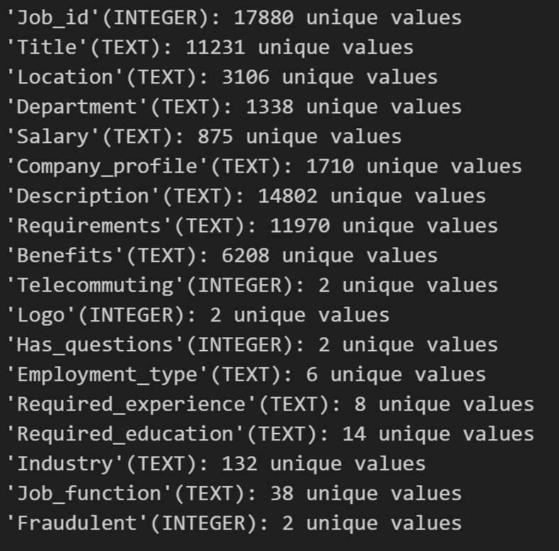
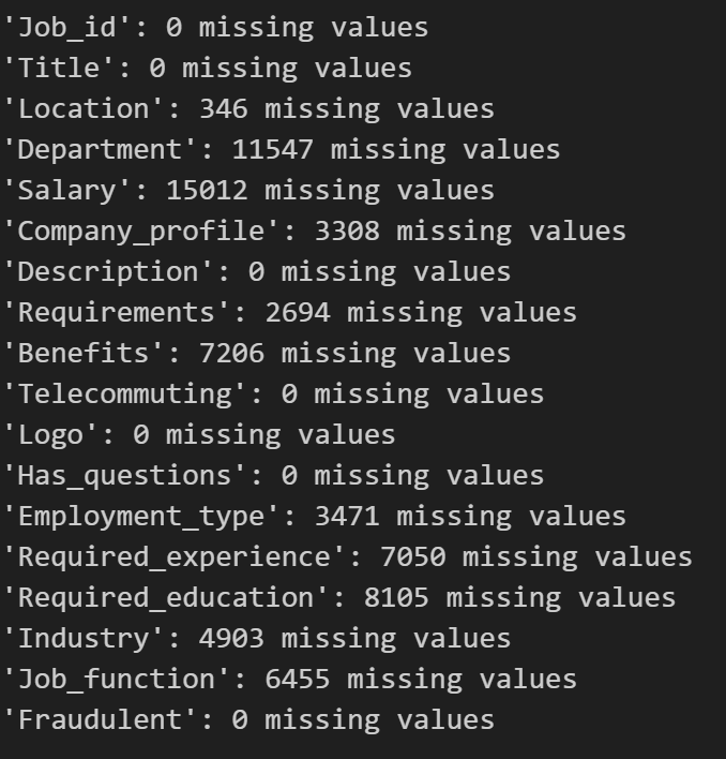
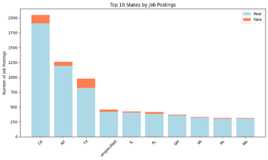
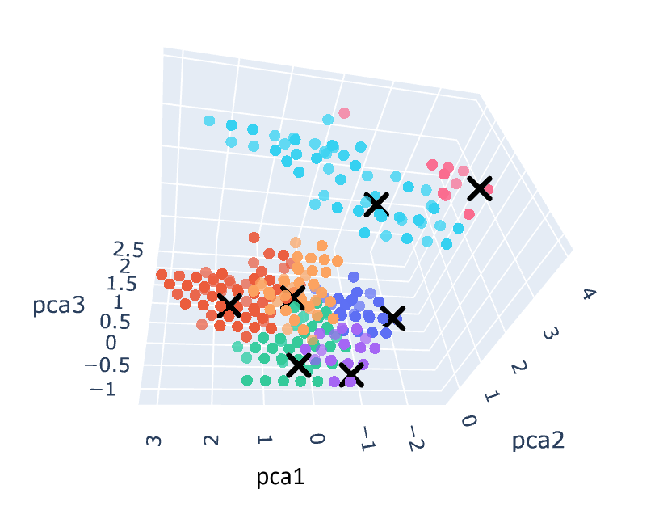
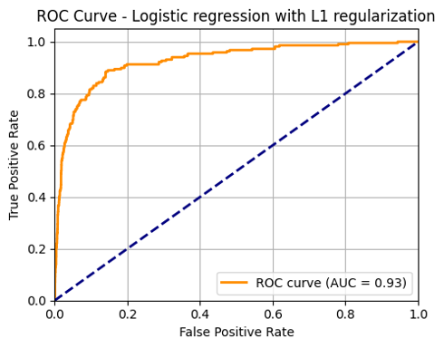

# SCAM or REAL? A Multi-Model Approach to Detecting Fraudulent Job postings
 
# Introduction 
Online job platforms have become a primary way for people to find employment, but they have also become a target for scammers posting fake job ads. These fraudulent postings can trick job seekers into sharing personal information or paying unnecessary fees. In this project, we analyze a dataset of job postings to explore the characteristics that distinguish real jobs from scams. 

The data was sourced from https://www.kaggle.com/datasets/whenamancodes/real-or-fake-jobs

# Dataset Overview & Database Setup

The data was provided in CSV format and was loaded into a local SQLite database named Fake_or_Real_Jobs.db using Python, with 'utf-8' encoding to correctly handle special characters such as punctuation and brackets.

The database contains one main table, Job_Posts, with 17,880 job postings and 18 fields (all text or integer types). Job_id serves as the unique identifier.

Built-in sqlite3 package in Python is used to connect to the database, create SQL queries, and retrieve data for analysis.

Several columns such as Title, Department, Description, Company_profile, Benefits and Requirements are highly unique and descriptive. Columns such as Employment_type, Required_experience, Required_education, Industry and Job_function have a smaller number of categories, while others like Telecommuting, Logo, Has_questions and Fraudulent are binary features.

# Data Cleaning and Processing

### Handling Missing Values

Many features had significant missing data. For the purposes of this project, missing values were retained and marked as 'unspecified', treating the absence of information as a potential signal of fraud.

### Location field transformation

The original Location field was split into Country, State, and City for more granular analysis. This allowed us to focus on regional patterns and reduce complexity during modeling.

### Filtering for U.S. Job Postings

The dataset included postings from 90 countries, but over 10,000 entries were from the U.S. To focus on a consistent subset that is more relevant from the personal perspective, a new table called Job_Posts_US was created, containing only U.S.-based postings and all fields from the original Job_Posts table except for Department and Salary, which were excluded due to having over 70% of missing values.

### Using Descriptive Fields As Binary Indicators

‘Requirements’, ‘Description’, ‘Company_profile’, and ‘Benefits’ with highly diverse and descriptive values were not modified. Instead, they will be used as binary indicators to capture whether or not this information is present in the job posting. 

### Managing High Cardinality in ‘Title’
‘Title’ contained over 11,000 unique values, making it highly diverse but potentially valuable for classification. To address this issue, the most frequent job titles were identified, and common keywords were extracted using text processing. Similar titles were then grouped into standardized categories to improve predictive power of the feature. The top 20 job titles were retained, while less frequent ones were consolidated under the label "Other".

### Preparing Categorical Features for Clustering
The ‘Employment_type’, ‘Required_experience’, ‘Required_education’, and ‘Job_function’ were cleaned by consolidating redundant values. To prepare these features for clustering, logical orderings were applied to reflect increasing levels of commitment, experience, and education. 

# Methodology 

To address the main project questions about the nature of fake job postings and whether we can predict them, clustering and classification methods were used. These approaches were well-suited for our dataset, which contains a mix of categorical and binary features and is highly imbalanced, with only 6.8% of postings labeled as fraudulent.

Scikit-learn (sklearn)  library — one of the most widely used machine learning libraries in Python — was used for data preprocessing and model training. The model_selection module was used to split the dataset into 70 – 30 training and testing sets, with stratification to address class imbalance. metrics module provided tools for evaluating performance through accuracy, confusion matrices, and ROC curves. 

One-hot encoding with get_dummies was used to convert categorical features into a numerical format suitable for classification models.

### K-Means clustering 
Implemented using ‘Fraudulent’, as well as ‘Employment_type’, ‘Required_experience’, and ‘Required_education’ ordinally encoded to reflect logical progression in job characteristics, making them suitable for distance-based clustering. Features were standardized using StandardScaler to ensure equal contribution to the clustering algorithm. Inertia and silhouette scores were used to determine the optimal number of clusters. PCA was used to reduced the data to three dimensions for visualization and better interpretation of cluster separation.

### Logistic Regression with L1 regularization
A model to predict the probability that a job posting is fraudulent based on a linear combination of input features. L1 regularization (Lasso) was applied to penalize the absolute magnitude of the coefficients, effectively performing automatic feature selection by shrinking less informative feature weights to zero to improve interpretability and generalization of the model.

### Random Forest Classifier
A machine learning method that builds multiple decision trees and aggregates their predictions. By introducing randomness in feature selection and data sampling (bagging), it reduces overfitting while maintaining accuracy. The model was tuned for optimal tree depth to balance bias and variance, class_weight='balanced' was applied to account for the imbalance in the dataset, and custom threshold was chosen to improve model’s ability to detect rare fraudulent postings. 

### XGBoost Classifier
An optimized gradient boosting algorithm that builds trees sequentially, where each new tree corrects the errors made by the previous ones. The model was configured with a controlled tree depth, scale_pos_weight to address class imbalance, and log-loss as the evaluation metric to optimize classification performance.

# Results 

K-Means clustering revealed seven distinct groupings among job postings. While some cluster overlap exists, the model effectively separated fake and real jobs, offering insight into their differing characteristics. Analysis of the cluster centers showed that fraudulent postings often either provide no job requirement information or target inexperienced, entry-level job seekers by offering roles with low education requirements and flexible employment arrangements. However, real job postings also frequently lack requirements details. Considering that the points within the ‘fake’ clusters are quite scattered, job requirements alone are not sufficient, and additional variables must be analyzed to more reliably distinguish between fake and legitimate job postings.

### Logistic Regression with L1 regularization
Test accuracy: 88.77%

AUC (Area Under the ROC Curve): 0.93

Logistic regression model performed well in predicting fraudulent job postings, with strong specificity and reasonably high sensitivity.
L1-regularization reduced the model from 1,634 one-hot-encoded features to just 221 non-zero coefficients, leading to dramatic reduction in model complexity and improved generalization potential.
The analysis of regression coefficients suggests that ‘City’ is most strongly associated with the likelihood of a job posting being fraudulent or real. 

